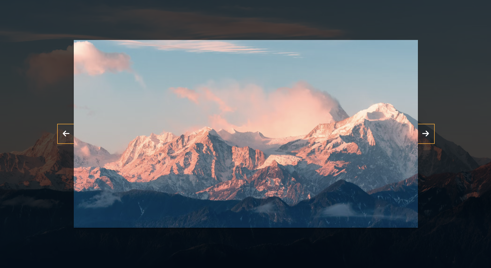

# 50 Projects in 50 Days - Background Slider

This is a code along project in the [50 Projects In 50 Days - HTML, CSS & JavaScript Udemy Course](https://www.udemy.com/course/50-projects-50-days/). Sharpen your skills by building 50 quick, unique & fun mini projects.

## Table of contents 😌

- [Overview](#overview)
  - [The project](#the-project)
  - [Screenshot](#screenshot)
  - [Links](#links)
- [My process](#my-process)
  - [Built with](#built-with)
  - [What I learned](#what-i-learned)
  - [Continued development](#continued-development)
  - [Code snippets](#im-really-proud-of-these-code-snippets%EF%B8%8F)
  - [Useful resources](#useful-resources)
- [Author](#author)
- [Acknowledgments](#acknowledgments)

## Overview👋🏾

Welcome to the 18<sup>th</sup> mini-project of the course!

### The project😥

In this project users will be able to:

- Build a responsive site that displays a dynamic slide show.

### Screenshot🌇



### Links👩🏾‍💻

- Live Site URL: (https://scintillating-genie-99a965.netlify.app/)

## My process💭

This is a simple project that I started by marking out the initial user interface by creating the structure and id's in the HTML file. Next I began styling the css by styling the overlay, slider container, and arrows. I then added functionality by way of JavaScript to cycle through both the slider and the background images for display when the user clicks the arrows.

### Built with👷🏾‍♀️

- Semantic HTML5 markup
- CSS custom properties
- Flexbox
- JavaScript

### What I learned👩🏾‍🏫

I learned the logic behind making a slide show functional. This is accomplished by importing the slides into a nodeList using the querySelectorAll pseudo selector, changing the background image to the background image for that particular slide, and then iterating through all the slides to remove the active class from one slide and add it to the next based on which arrow the user clicked.

I also learned that when using the before or after selectors you MUST add content for the style to be visible.

### Continued development🔮

In the future I plan on continuing to practice positioning elements using flexbox, and using different selectors such as nth of type to select elements.

I also plan on continuing to practice using event listeners to make my pages more functional.

I also plan on continuing to learn the best ways to phrase git commits, so that future viewers can fully understand the changes that have occurred.

### I'm really proud of these code snippets✂️

```js
rightBtn.addEventListener('click', () => {
    activeSlide++

    if (activeSlide > slides.length - 1) {
        activeSlide = 0
    }
    setBgToBody()
    setActiveSlide()
})

leftBtn.addEventListener('click', () => {
    activeSlide--

    if (activeSlide < 0) {
        activeSlide = slides.length - 1
    }
    setBgToBody()
    setActiveSlide()
})
```

### Useful resources📖

- [Resource](https://www.freecodecamp.org/news/how-to-write-better-git-commit-messages/) - This is an amazing article which helped me write better commit messages. I'd recommend it to anyone still learning this concept.

## Author🔎

- Website - [Portfolio Site](https://www.maiannethornton.com/Portfolio/index.html)
- Frontend Mentor - [@MaianneThornton](https://www.frontendmentor.io/profile/MaianneThornton)
- GitHub - [@MaianneThornton](GitHub.com/MaianneThornton)
- Twitter - [@MaianneThornton](https://twitter.com/MaianneThornton)
- LinkedIn - [@MaianneThornton](https://www.linkedin.com/in/maiannethornton/)

## Acknowledgments🙏🏾

Special Thanks go to [Brad Traversy](http://www.traversymedia.com/) and [Florin Pop](http://www.florin-pop.com/) creating the course and making reviewing concepts fun 😊.
